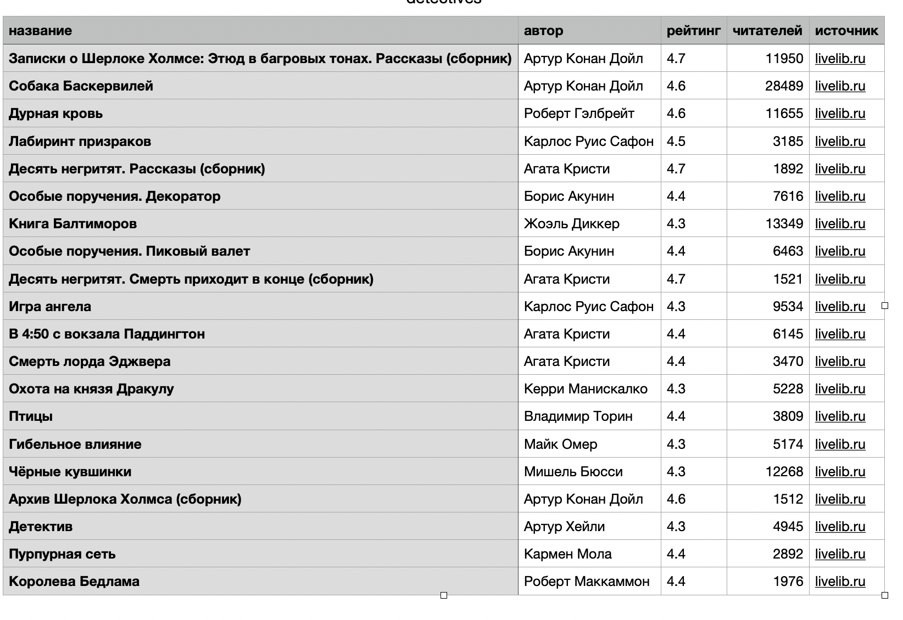

# Price Scraper — парсер книг-детективов

Скрипт на Python, который собирает названия, авторов, рейтинги и число
прочитавших читателей для русскоязычных детективов с сайта
[livelib.ru](https://www.livelib.ru) и сохраняет их в CSV-файл (открывается
в Excel/Google Sheets).

Livelib — сайт отзывов и рейтингов книг (не интернет-магазин), поэтому цены
там нет — вместо неё в колонках показана более уместная для этого сайта
метрика: сколько человек отметили книгу как прочитанную.



**Почему именно этот сайт.** Перед тем как что-либо парсить, стоит проверить
`robots.txt` сайта. У крупных книжных магазинов (Лабиринт, Читай-город,
Book24) каталог книг явно закрыт для автоматического сбора данных — их
правила это запрещают. У livelib.ru, наоборот, страницы жанров и книг
разрешены (проверено 16.07.2026) — запрещены только служебные подстраницы.

## Что делает скрипт

1. Открывает страницу топ-100 жанра "Детективы" на livelib.ru.
2. С каждой карточки книги забирает: название, автора, рейтинг, число прочитавших.
3. Сохраняет первые 20 (по умолчанию) в файл `detectives.csv`.

## Установка и запуск

```bash
cd price-scraper
python3 -m venv venv
source venv/bin/activate   # на Windows: venv\Scripts\activate
pip install -r requirements.txt
```

Запуск (соберёт 20 детективов по умолчанию):

```bash
python3 scraper.py
```

Собрать больше или меньше книг:

```bash
python3 scraper.py --count 50
```

Сохранить в файл с другим именем:

```bash
python3 scraper.py --count 50 --output my_detectives.csv
```

Результат — файл `detectives.csv` (или указанный тобой) в этой же папке.
Столбцы: `название`, `автор`, `рейтинг`, `читателей`, `источник`.

## Как адаптировать под другой жанр или сайт

Этот скрипт — шаблон. Чтобы собирать другой жанр с того же сайта, замени
`GENRE_URL` на адрес нужной страницы жанра (структура HTML останется той же).

Чтобы перейти на другой сайт:

1. Открой страницу нужного сайта, найди в HTML-коде (через "Просмотр кода
   страницы" в браузере) селекторы для нужных данных (название, цена и т.д.).
2. Замени `GENRE_URL` и селекторы в функции `parse_books` под структуру этого сайта.

**Перед тем как парсить любой новый сайт:**
- Проверь файл `сайт.ру/robots.txt` — там написано, что сайт разрешает собирать автоматически, а что нет.
- Проверь пользовательское соглашение сайта (Terms of Service) на предмет запрета скрейпинга.
- Добавь паузу между запросами (`time.sleep`), если страниц несколько — это не только вежливо, но и снижает риск блокировки твоего IP.

## Структура проекта

```
price-scraper/
├── scraper.py          # код парсера
├── requirements.txt    # список нужных библиотек
├── .gitignore          # какие файлы не нужно загружать в git
└── README.md            # эта инструкция
```
